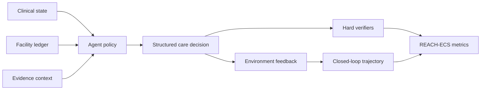

# REACH: Resource-Constrained Evaluation of Agentic Circuits in Healthcare

**REACH** is a benchmark and reference code skeleton for evaluating medical agents that must make **resource-constrained primary-care decisions**, not just answer medical questions. It models care as an executable circuit: a patient state, a facility readiness profile, an action, environment feedback metadata, evidence traces, and hard verifiers.

> **TL;DR**: REACH turns resource-constrained primary care into an executable agent benchmark with facility ledgers, evidence traces, hard verifiers, and expert-audited care-process metrics.

This repository is the public code skeleton for the NeurIPS 2026 submission. It includes schemas, metric utilities, verifier scaffolds, example cases, and release documentation. It intentionally does **not** include API keys, model weights, private run logs, raw guideline text, or non-public data artifacts.

## Why REACH?

Most medical benchmarks ask whether a model can produce the right textbook answer. REACH asks a different question:

**Can an agent decide what to do for this patient, in this clinic, with these available drugs, tests, transport options, and follow-up channels?**

The same clinical presentation may call for different actions depending on the facility ledger. A safe answer must therefore combine clinical state, resource feasibility, evidence grounding, urgency, referral need, and continuity of care.



## Benchmark Snapshot

The current manuscript snapshot reports:

| Component | Scale |
|---|---:|
| Structured cases | 49,286 |
| Case-facility pairs | 142,613 |
| OOD stress cases | 8,198 |
| Facility profiles | 1,184 |
| Accepted training transitions | 228,955 |
| Expert-audited trajectories | 812 |
| Atomic rubric criteria | 4,872 |

Evaluation is organized around structured care decisions spanning:

`diagnostic_check`, `start_treatment`, `follow_up`, `refer`, `emergency_stabilize`, and `reassure_selfcare`.

## Main Result Snapshot

Numbers below are manuscript-aligned summary values. They are provided to make the public skeleton interpretable; the version-locked data release and full reproducibility artifacts will be released separately.

| Setting | Method | REACH-ECS |
|---|---|---:|
| ID test | Local SFT policy | 0.672 [0.651, 0.692] |
| ID test | REACH-VRC | 0.803 [0.787, 0.819] |
| Closed-loop rollout | Prompted baseline | 0.482 [0.458, 0.505] |
| Closed-loop rollout | SFT policy | 0.604 [0.579, 0.627] |
| Closed-loop rollout | REACH-VRC | 0.758 [0.728, 0.785] |
| OOD stress | SFT policy | 0.601 [0.578, 0.624] |
| OOD stress | GRPO | 0.661 [0.638, 0.683] |
| OOD stress | RAPO-memory | 0.712 [0.686, 0.738] |
| OOD stress | REACH-VRC | 0.765 [0.741, 0.789] |

REACH-VRC refers to **REACH Verifier-Routed Composition**, the verifier-routed circuit policy used in the manuscript. It should not be interpreted as a deployed clinical system.

## Repository Contents

```text
reach/
  schemas.py        # canonical actions, decision fields, lightweight validators
  metrics.py        # action, urgency, referral, recall, and composite metric helpers
  verifiers.py      # schema/resource/evidence verifier scaffolds
  runtime.py        # minimal executable care-circuit interface
  router.py         # verifier-routed candidate selection skeleton
scripts/
  evaluate_outputs.py       # evaluate predictions against JSON/JSONL gold files
examples/
  case_example.json
  prediction_example.json
  verifier_trace_example.json
configs/
  reach_eval.yaml
  model_registry.example.yaml
docs/
  benchmark_overview.md
  data_statement.md
  paper_numbers.md
  release_checklist.md
```

## Minimal Usage

Install the lightweight dependencies:

```bash
pip install -r requirements.txt
```

Run the toy evaluator on the included examples:

```bash
python scripts/evaluate_outputs.py \
  --gold examples/case_example.json \
  --pred examples/prediction_example.json
```

The public skeleton is designed to show the benchmark contract and evaluation logic. It is not intended to reproduce the full private training pipeline from a single command.

## Data Release Plan

This GitHub repository contains code, documentation, and small non-clinical examples only. The full benchmark data should be hosted as a separate dataset release, preferably on Hugging Face Datasets or an equivalent archival dataset platform, with:

- a dataset card,
- split definitions,
- versioned schema,
- audit metadata,
- license and use restrictions,
- and explicit non-clinical-use disclaimers.

## Safety Boundary

REACH is a research benchmark. It is **not** a medical device, clinical decision-support product, triage tool, or deployment-ready system. The examples are illustrative, abstracted, and non-clinical; they must not be used for patient care. Environment feedback metadata is benchmark instrumentation and is always subordinate to hard verifiers and expert audit.

## Citation

If you use REACH, please cite the forthcoming paper:

```bibtex
@inproceedings{reach2026,
  title     = {REACH: Resource-Constrained Evaluation of Agentic Circuits in Healthcare},
  author    = {REACH Authors},
  booktitle = {NeurIPS},
  year      = {2026},
  note      = {Dataset and benchmark submission}
}
```
